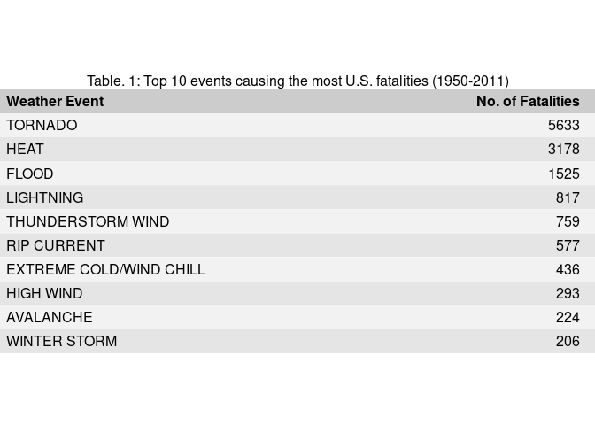
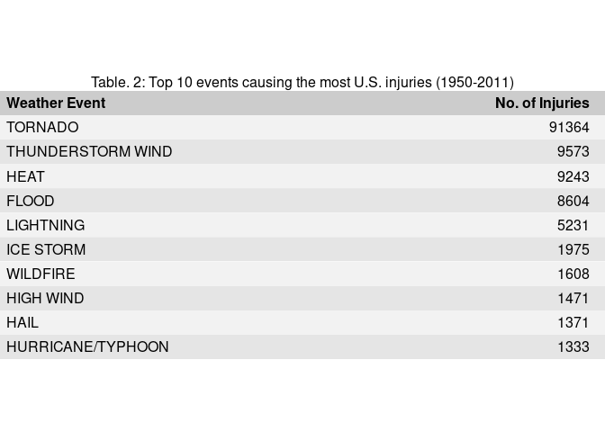

## Introduction

Storms and other severe weather events can cause both public health and economic problems for communities and municipalities. Many severe events can result in fatalities, injuries, and property damage, and preventing such outcomes to the extent possible is a key concern.

This project involves exploring the U.S. National Oceanic and Atmospheric Administration's (NOAA) storm database. This database tracks characteristics of major storms and weather events in the United States, including when and where they occur, as well as estimates of any fatalities, injuries, and property damage.

## Synopsis

We address the following questions through analysis of the NOAA Storm Database:

1. Across the United States, which types of events (as indicated in the EVTYPE variable) are most harmful with respect to population health?
2. Across the United States, which types of events have the greatest economic consequences?


## Data Processing

First, we load the required packages and install them first if they are not available:


```r
if (!require("pacman")) install.packages("pacman")
```

```
## Loading required package: pacman
```

```r
pacman::p_load(knitr, dplyr, ggplot2, tidyr, hexbin, timeDate, grid, gridExtra, gtable)
```

Next we download and unzip the data file to read in the dataset:


```r
destfile <- 'repdata%2Fdata%2FStormData.csv.bz2'
url <- 'https://d396qusza40orc.cloudfront.net/repdata%2Fdata%2FStormData.csv.bz2'

if (!file.exists(destfile))
  download.file(url, destfile, method = "auto")

df <- read.csv(destfile)
```

We will explore the dataset using the `head()` and `str()` functions:


```r
head(df)
```

```
##   STATE__           BGN_DATE BGN_TIME TIME_ZONE COUNTY COUNTYNAME STATE
## 1       1  4/18/1950 0:00:00     0130       CST     97     MOBILE    AL
## 2       1  4/18/1950 0:00:00     0145       CST      3    BALDWIN    AL
## 3       1  2/20/1951 0:00:00     1600       CST     57    FAYETTE    AL
## 4       1   6/8/1951 0:00:00     0900       CST     89    MADISON    AL
## 5       1 11/15/1951 0:00:00     1500       CST     43    CULLMAN    AL
## 6       1 11/15/1951 0:00:00     2000       CST     77 LAUDERDALE    AL
##    EVTYPE BGN_RANGE BGN_AZI BGN_LOCATI END_DATE END_TIME COUNTY_END
## 1 TORNADO         0                                               0
## 2 TORNADO         0                                               0
## 3 TORNADO         0                                               0
## 4 TORNADO         0                                               0
## 5 TORNADO         0                                               0
## 6 TORNADO         0                                               0
##   COUNTYENDN END_RANGE END_AZI END_LOCATI LENGTH WIDTH F MAG FATALITIES
## 1         NA         0                      14.0   100 3   0          0
## 2         NA         0                       2.0   150 2   0          0
## 3         NA         0                       0.1   123 2   0          0
## 4         NA         0                       0.0   100 2   0          0
## 5         NA         0                       0.0   150 2   0          0
## 6         NA         0                       1.5   177 2   0          0
##   INJURIES PROPDMG PROPDMGEXP CROPDMG CROPDMGEXP WFO STATEOFFIC ZONENAMES
## 1       15    25.0          K       0                                    
## 2        0     2.5          K       0                                    
## 3        2    25.0          K       0                                    
## 4        2     2.5          K       0                                    
## 5        2     2.5          K       0                                    
## 6        6     2.5          K       0                                    
##   LATITUDE LONGITUDE LATITUDE_E LONGITUDE_ REMARKS REFNUM
## 1     3040      8812       3051       8806              1
## 2     3042      8755          0          0              2
## 3     3340      8742          0          0              3
## 4     3458      8626          0          0              4
## 5     3412      8642          0          0              5
## 6     3450      8748          0          0              6
```

```r
str(df)
```

```
## 'data.frame':	902297 obs. of  37 variables:
##  $ STATE__   : num  1 1 1 1 1 1 1 1 1 1 ...
##  $ BGN_DATE  : Factor w/ 16335 levels "1/1/1966 0:00:00",..: 6523 6523 4242 11116 2224 2224 2260 383 3980 3980 ...
##  $ BGN_TIME  : Factor w/ 3608 levels "00:00:00 AM",..: 272 287 2705 1683 2584 3186 242 1683 3186 3186 ...
##  $ TIME_ZONE : Factor w/ 22 levels "ADT","AKS","AST",..: 7 7 7 7 7 7 7 7 7 7 ...
##  $ COUNTY    : num  97 3 57 89 43 77 9 123 125 57 ...
##  $ COUNTYNAME: Factor w/ 29601 levels "","5NM E OF MACKINAC BRIDGE TO PRESQUE ISLE LT MI",..: 13513 1873 4598 10592 4372 10094 1973 23873 24418 4598 ...
##  $ STATE     : Factor w/ 72 levels "AK","AL","AM",..: 2 2 2 2 2 2 2 2 2 2 ...
##  $ EVTYPE    : Factor w/ 985 levels "   HIGH SURF ADVISORY",..: 834 834 834 834 834 834 834 834 834 834 ...
##  $ BGN_RANGE : num  0 0 0 0 0 0 0 0 0 0 ...
##  $ BGN_AZI   : Factor w/ 35 levels "","  N"," NW",..: 1 1 1 1 1 1 1 1 1 1 ...
##  $ BGN_LOCATI: Factor w/ 54429 levels ""," Christiansburg",..: 1 1 1 1 1 1 1 1 1 1 ...
##  $ END_DATE  : Factor w/ 6663 levels "","1/1/1993 0:00:00",..: 1 1 1 1 1 1 1 1 1 1 ...
##  $ END_TIME  : Factor w/ 3647 levels ""," 0900CST",..: 1 1 1 1 1 1 1 1 1 1 ...
##  $ COUNTY_END: num  0 0 0 0 0 0 0 0 0 0 ...
##  $ COUNTYENDN: logi  NA NA NA NA NA NA ...
##  $ END_RANGE : num  0 0 0 0 0 0 0 0 0 0 ...
##  $ END_AZI   : Factor w/ 24 levels "","E","ENE","ESE",..: 1 1 1 1 1 1 1 1 1 1 ...
##  $ END_LOCATI: Factor w/ 34506 levels ""," CANTON"," TULIA",..: 1 1 1 1 1 1 1 1 1 1 ...
##  $ LENGTH    : num  14 2 0.1 0 0 1.5 1.5 0 3.3 2.3 ...
##  $ WIDTH     : num  100 150 123 100 150 177 33 33 100 100 ...
##  $ F         : int  3 2 2 2 2 2 2 1 3 3 ...
##  $ MAG       : num  0 0 0 0 0 0 0 0 0 0 ...
##  $ FATALITIES: num  0 0 0 0 0 0 0 0 1 0 ...
##  $ INJURIES  : num  15 0 2 2 2 6 1 0 14 0 ...
##  $ PROPDMG   : num  25 2.5 25 2.5 2.5 2.5 2.5 2.5 25 25 ...
##  $ PROPDMGEXP: Factor w/ 19 levels "","-","?","+",..: 17 17 17 17 17 17 17 17 17 17 ...
##  $ CROPDMG   : num  0 0 0 0 0 0 0 0 0 0 ...
##  $ CROPDMGEXP: Factor w/ 9 levels "","?","0","2",..: 1 1 1 1 1 1 1 1 1 1 ...
##  $ WFO       : Factor w/ 542 levels ""," CI","%SD",..: 1 1 1 1 1 1 1 1 1 1 ...
##  $ STATEOFFIC: Factor w/ 250 levels "","ALABAMA, Central",..: 1 1 1 1 1 1 1 1 1 1 ...
##  $ ZONENAMES : Factor w/ 25112 levels "","                                                                                                               "| __truncated__,..: 1 1 1 1 1 1 1 1 1 1 ...
##  $ LATITUDE  : num  3040 3042 3340 3458 3412 ...
##  $ LONGITUDE : num  8812 8755 8742 8626 8642 ...
##  $ LATITUDE_E: num  3051 0 0 0 0 ...
##  $ LONGITUDE_: num  8806 0 0 0 0 ...
##  $ REMARKS   : Factor w/ 436781 levels "","\t","\t\t",..: 1 1 1 1 1 1 1 1 1 1 ...
##  $ REFNUM    : num  1 2 3 4 5 6 7 8 9 10 ...
```

There are many variables present in this dataset, not all of which will be relevant to our analysis. We recap our goal:

1. To find out which **EVTYPE**(-s) is most harmful to **population health** across the US
2. To find out which **EVTYPE**(-s) have the greatest **economic consequences**

Therefore, we will narrow down the number of variables to those that are related to **EVTYPE**, **population health** and **economic consequences**.

Population health: 

* `FATALITIES`
* `INJURIES` 

Economic consequences: 

* `PROPDMG` 
* `PROPDMGEXP` 
* `CROPDMG` 
* `CROPDMGEXP` 

We will select these variables from the original dataset in addition to `EVTYPE` for obvious reasons, and `STATE__` in order to analyse the spatial variation of population health and economic consequences:


```r
df_filtered <- select(df, EVTYPE, STATE__, FATALITIES, INJURIES, 
                      PROPDMG, PROPDMGEXP, CROPDMG, CROPDMGEXP)
```

The proportion of missing values in the dataframe is first determined for the relevant variables:


```r
mean(is.na(df_filtered))
```

```
## [1] 0
```

Surprisingly there is a complete absence of missing variables.

Next we examine the variable `EVTYPE`:


```r
unique(df_filtered$EVTYPE)
```

It is clear that there are many duplicates, errors and variants present in the variable `EVTYPE`. Therefore we will proceed by cleaning up this variable, using regular expressions to substitute variable names with the correct variable.


```r
event <- df_filtered$EVTYPE
event <- gsub('.*TSTM.*', 'THUNDERSTORM WIND', event, ignore.case=TRUE)
event <- gsub('.*THUNDER.*', 'THUNDERSTORM WIND', event, ignore.case=TRUE)
event <- gsub('.*THUND.*', 'THUNDERSTORM WIND', event, ignore.case=TRUE)
event <- gsub('.*micro.*', 'THUNDERSTORM WIND', event, ignore.case=TRUE)
event <- gsub('.*SPOUT.*', 'WATERSPOUT', event, ignore.case=TRUE)
event <- gsub('.*TORNADO.*', 'TORNADO', event, ignore.case=TRUE)
event <- gsub('^HIGH WIND.*', 'HIGH WIND', event, ignore.case=TRUE)
event <- gsub('.*AVALANCHE.*', 'AVALANCHE', event, ignore.case=TRUE)
event <- gsub('.*BLIZZARD.*', 'BLIZZARD', event, ignore.case=TRUE)
event <- gsub('.*SNOW.*', 'HEAVY SNOW', event, ignore.case=TRUE)
event <- gsub('.*HURRICANE.*', 'HURRICANE/TYPHOON', event, ignore.case=TRUE)
event <- gsub('.*TYPHOON.*', 'HURRICANE/TYPHOON', event, ignore.case=TRUE)
event <- gsub('.*HEAT.*', 'HEAT', event, ignore.case=TRUE)
event <- gsub('.*HOT.*', 'HEAT', event, ignore.case=TRUE)
event <- gsub('.*WARM.*', 'HEAT', event, ignore.case=TRUE)
event <- gsub('.*HIGH TEMP.*', 'HEAT', event, ignore.case=TRUE)
event <- gsub('.*COLD.*', 'EXTREME COLD/WIND CHILL', event, ignore.case=TRUE)
event <- gsub('.*HAIL.*', 'HAIL', event, ignore.case=TRUE)
event <- gsub('.*flash.flood.*', 'FLASH FLOOD', event, ignore.case=TRUE)
event <- gsub('.*flash.*', 'FLASH FLOOD', event, ignore.case=TRUE)
event <- gsub('.*LIGHTNING.*', 'LIGHTNING', event, ignore.case=TRUE)
event <- gsub('(?<!FLASH )FLOOD.*', 'FLOOD', event, ignore.case=TRUE, perl=TRUE)
event <- gsub('.*FLOOD.*', 'FLOOD', event, ignore.case=TRUE)
event <- gsub('.*FUNNEL.*', 'FUNNEL CLOUD', event, ignore.case=TRUE)
event <- gsub('.*FIRE.*', 'WILDFIRE', event, ignore.case=TRUE)
event <- gsub('.*TROPICAL STORM.*', 'TROPICAL STORM', event, ignore.case=TRUE)
event <- gsub('.*CURRENT.*', 'RIP CURRENT', event, ignore.case=TRUE)
event <- gsub('.*DRY.*', 'DROUGHT', event, ignore.case=TRUE)
event <- gsub('(?<!FREEZING )RAIN.*', 'HEAVY RAIN', event, ignore.case=TRUE, perl=TRUE)
event <- gsub('.*RAIN.*', 'HEAVY RAIN', event, ignore.case=TRUE)
event <- gsub('.*dust.*', 'DUST STORM', event, ignore.case=TRUE)
#table(grep('tornado',event,ignore.case=TRUE,value=TRUE, perl=TRUE))
#unique(event)

df_filtered$EVTYPE <- event
```

Having completed the cleaning of the data, we will split the dataset into two parts, one to determine the effect of these weather events on human health and the other to determine their effect on the economy. The portion related to human health is then further split into two portions, one describing human fatalities and one describing human injuries. 


```r
health <- df_filtered %>% 
  select(EVTYPE, FATALITIES, INJURIES) %>%
  group_by(EVTYPE) %>% 
  summarise_all(funs(sum))

fatalities <- health %>%
  select(EVTYPE, FATALITIES) %>%
  arrange(desc(FATALITIES)) %>%
  top_n(10)
```

```
## Selecting by FATALITIES
```

```r
injuries <- health %>%
  select(EVTYPE, INJURIES) %>%
  arrange(desc(INJURIES)) %>%
  top_n(10)
```

```
## Selecting by INJURIES
```

Next we can examine the variables `PROPDMGEXP` and `CROPDMGEXP`:


```r
economic <- df_filtered %>% select(EVTYPE, PROPDMG, PROPDMGEXP, CROPDMG, CROPDMGEXP)
unique(economic$PROPDMGEXP)
```

```
##  [1] K M   B m + 0 5 6 ? 4 2 3 h 7 H - 1 8
## Levels:  - ? + 0 1 2 3 4 5 6 7 8 B h H K m M
```

```r
unique(economic$CROPDMGEXP)
```

```
## [1]   M K m B ? 0 k 2
## Levels:  ? 0 2 B k K m M
```

The variables `PROPDMGEXP` and `CROPDMGEXP` denote the exponent that is meant to be multiplied with `PROPDMG` and `CROPDMG` respectively in order to obtain the actual values of property and crop damag. Therefore in order to proceed it is required to transform the values under `PROPDMGEXP` and `CROPDMGEXP` to their actual numerical values.


```r
economic$PROPDMGEXP <- with(economic, ifelse(PROPDMGEXP=='H'|PROPDMGEXP=='h', 1e2,
                                      ifelse(PROPDMGEXP=='K'|PROPDMGEXP=='k', 1e3,
                                      ifelse(PROPDMGEXP=='M'|PROPDMGEXP=='m', 1e6,
                                      ifelse(PROPDMGEXP=='B'|PROPDMGEXP=='b', 1e9, 
                                      ifelse(grepl('[0-8]',PROPDMGEXP), 1e1,
                                      ifelse(PROPDMGEXP=='+', 1e0, 0)))))))

economic$CROPDMGEXP <- with(economic, ifelse(CROPDMGEXP=='H'|CROPDMGEXP=='h', 1e2,
                                      ifelse(CROPDMGEXP=='K'|CROPDMGEXP=='k', 1e3,
                                      ifelse(CROPDMGEXP=='M'|CROPDMGEXP=='m', 1e6,
                                      ifelse(CROPDMGEXP=='B'|CROPDMGEXP=='b', 1e9,
                                      ifelse(grepl('[0-8]',CROPDMGEXP), 1e1,
                                      ifelse(CROPDMGEXP=='+', 1e0, 0)))))))

economic$PROPDMG <- economic$PROPDMG * economic$PROPDMGEXP 
economic$CROPDMG <- economic$CROPDMG * economic$CROPDMGEXP
```

Similar to before, the dataset `economic` is split into two parts, one to describe property damage and the other to describe crop damage:


```r
economic <- economic %>% 
  select(EVTYPE, PROPDMG, CROPDMG) %>%
  group_by(EVTYPE) %>%
  summarise_all(funs(sum))

propdmg <- economic %>%
  select(EVTYPE, PROPDMG) %>%
  arrange(desc(PROPDMG)) %>%
  top_n(10)
```

```
## Selecting by PROPDMG
```

```r
cropdmg <- economic %>%
  select(EVTYPE, CROPDMG) %>%
  arrange(desc(CROPDMG)) %>%
  top_n(10)
```

```
## Selecting by CROPDMG
```

Finally we express the prop and property damages in the billions for easy viewing:


```r
propdmg$PROPDMG <- round(propdmg$PROPDMG / 1e9, 2)
cropdmg$CROPDMG <- round(cropdmg$CROPDMG / 1e9, 2)
```

With these steps complete, we are ready to present our results.

## Results

We select the top 10 event types that contribute the most harm to population health.


```r
h1 <- ggplot(fatalities, aes(x=reorder(EVTYPE, FATALITIES), y=FATALITIES)) +
  geom_bar(stat="identity") + theme(aspect.ratio=1.) + coord_flip() +
  labs(x="Weather Event", y="No. of Fatalities")
h2 <- ggplot(injuries, aes(x=reorder(EVTYPE, INJURIES), y=INJURIES)) +
  geom_bar(stat="identity") + theme(aspect.ratio=1.) + coord_flip() +
  labs(x="Weather Event", y="No. of Injuries")

g1 <- ggplotGrob(h1)
g2 <- ggplotGrob(h2)
plottitle <- textGrob(
  'Fig. 1: Top 10 events harmful to U.S. population health (1950-2011)', just='centre')

g1$widths[4] <- unit(3,"null")
g <- gtable_rbind(g1, g2, size='first')
g <- gtable_add_rows(g, grobHeight(plottitle)+unit(2,"mm"), pos=0)
g <- gtable_add_grob(g, plottitle, 1, 1, r=7)

grid.newpage()
grid.draw(g)
```

<!-- -->


```r
l1 <- ggplot(propdmg, aes(x=reorder(EVTYPE, PROPDMG), y=PROPDMG)) +
  geom_bar(stat="identity") + theme(aspect.ratio=1.) + coord_flip() +
  labs(x="Weather Event", y="Property Damage (Billion USD)")
l2 <- ggplot(cropdmg, aes(x=reorder(EVTYPE, CROPDMG), y=CROPDMG)) +
  geom_bar(stat="identity") + theme(aspect.ratio=1.) + coord_flip() +
  labs(x="Weather Event", y="Crop Damage")

k1 <- ggplotGrob(l1)
k2 <- ggplotGrob(l2)
plottitle2 <- textGrob(
  'Fig. 2: Top 10 events harmful to U.S. economy (1950-2011)', just='centre')

g1$widths[4] <- unit(3,"null")
k <- gtable_rbind(k1, k2, size='first')
k <- gtable_add_rows(k, grobHeight(plottitle2)+unit(2,"mm"), pos=0)
k <- gtable_add_grob(k, plottitle2, 1, 1, r=7)

grid.newpage()
grid.draw(k)
```

<!-- -->

## Conclusion
